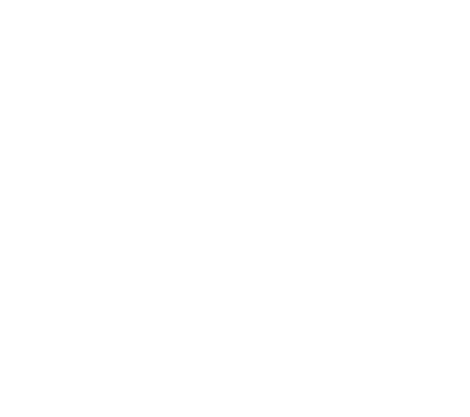

NOTE: Add the files that edited into this folder when we need submit

## 3.3

Given the string:
`let z = (17) in z + 2 * 3 end EOF`
The rightmost derivation, following the gramme rules (A-I) is:

1. Expr EOF (A)
2. LET NAME EQ Expr IN Expr END EOF (F)
3. LET NAME EQ Expr IN Expr TIMES Expr END EOF (G)
4. LET NAME EQ Expr IN Expr TIMES CSTINT END EOF (C)
5. LET NAME EQ Expr IN Expr PLUS Expr TIMES CSTINT END EOF (H)
6. LET NAME EQ Expr IN Expr PLUS CSTINT TIMES CSTINT END EOF (C)
7. LET NAME EQ Expr IN NAME PLUS CSTINT TIMES CSTINT END EOF (B)
8. LET NAME EQ LPAR Expr RPAR IN NAME PLUS CSTINT TIMES CSTINT END EOF (E)
9. LET NAME EQ LPAR CSTINT RPAR IN NAME PLUS CSTINT TIMES CSTINT END EOF (C)

## 3.3

Bellow is the image of the tree.
One is with white text, the other with black text.
There is two images just in case, for dark mode or not.
The images shows the above derivation as a tree

