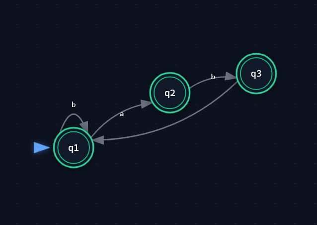
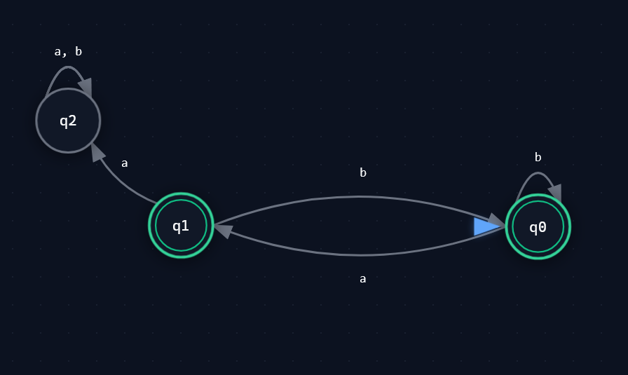

NOTE: Add the files that edited into this folder when we need submit

## 2.4
Created the two functions sinstrToInt & assemble.

sinstrToInt:
Takes stack instruction and converts them to their respective Bytecode representation
SCstI and var i adds "instructionvalue" ; i to the list, which the machine then reads as, arh we have 0, now I will read the next as the constant and not a operation. Same with var; value 1 tells the same story.
Machines reads list from left to right which we will also have to account for in assemble function. Prepares the machine for what is coming so that it cant be misinterpereted as a instruction.
all the remaining just send their instruction values to the list.

Assemble: Eats sInstruction list, runs through it with helper function w. accumulator
since adding from behind is expensive we have to account for having to reverse the list at the end.sinList
if we had 0 i 0 i 2
We would get 2 @ 0 i 0 i when appending the last int list returned from sinstr, which would give us the following when reversed
i 0 i 0 2 which the machine would have less of a great time with.
Thats why we also have to reverse the returned int list from sinstr before appending, so when list is reversed the machine gets warned about the next "value"
not being an instruction.

## 3.2

Regular expression for recognizing strings consisting of
a and b where two a’s are always separated by at least one b

(b|ab)*(a|ϵ)

Corresponding NFA and DFA:

## 3.3

Given the string:
`let z = (17) in z + 2 * 3 end EOF`.
The rightmost derivation, following the gramme rules (A-I) is:

1. Expr EOF (A)
2. LET NAME EQ Expr IN Expr END EOF (F)
3. LET NAME EQ Expr IN Expr TIMES Expr END EOF (G)
4. LET NAME EQ Expr IN Expr TIMES CSTINT END EOF (C)
5. LET NAME EQ Expr IN Expr PLUS Expr TIMES CSTINT END EOF (H)
6. LET NAME EQ Expr IN Expr PLUS CSTINT TIMES CSTINT END EOF (C)
7. LET NAME EQ Expr IN NAME PLUS CSTINT TIMES CSTINT END EOF (B)
8. LET NAME EQ LPAR Expr RPAR IN NAME PLUS CSTINT TIMES CSTINT END EOF (E)
9. LET NAME EQ LPAR CSTINT RPAR IN NAME PLUS CSTINT TIMES CSTINT END EOF (C)

## 3.4

Bellow is the image of the tree.
One is with white text, the other with black text.
There is two images just in case, for dark mode or not.
The images shows the above derivation as a tree

