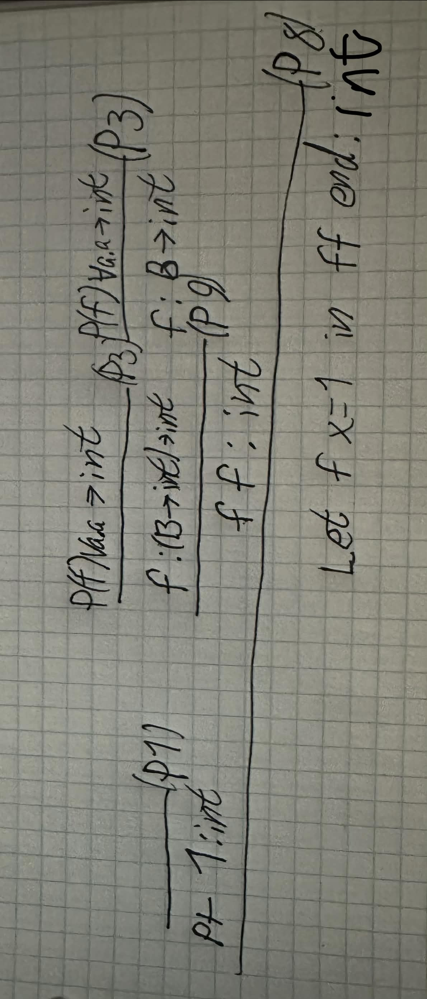
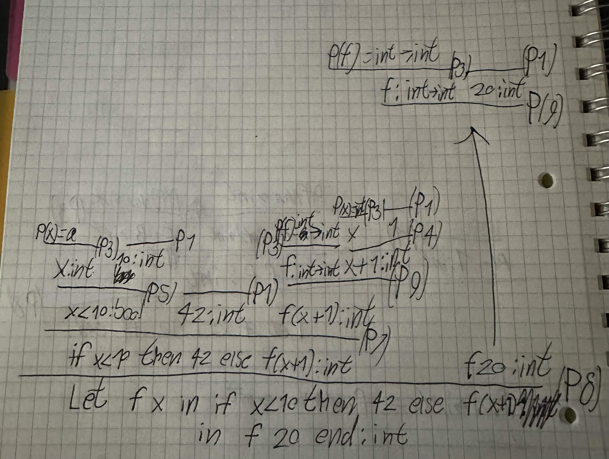

# Exercise 6.4

#### (i)

type rule tree for the following:

```fsharp
let f x = 1
in f f end
```



f is used as two different types in f f, both the function being called and as the argument.

#### (ii)
type rule tree for the following:

```fsharp
let f x = if x<10 then 42 else f(x+1)
in f 20 end
```



f should not be polymorphic, because the function body forces both input and output to be of a certain type (int in this case).
so it does not become generalized.

# Exercise 6.5

# Exercise 7.1

I have created the Lex and parser files. And have test run the programs

# Exercise 7.2

To run the files first

```bash
dotnet fsi -r bin/Debug/net10.0/FsLexYacc.Runtime.dll \
    Absyn.fs CPar.fs CLex.fs Parse.fs \
    Interp.fs ParseAndRun.fs
```

Then execute:

```fsharp
open ParseAndRun;;
```

Down bellow are the commands you can send to the fs interactive.
The paths might be different depending on where you invoke fs interactive.

## (i)

This program does not use for loops but instead while loops.
The argument should be between 1-4. Though it is not enforced.
Calling the program with a higher or lower argument will cause undefined behaviour.

```fsharp
let ex01 = fromFile "CEx/ex01.c";;
```

```fsharp
run ex01 [3];;
```

## (ii)

This program prints each number squared number on a new line.
If given an input number that is higher that 20 it is clamped to 20.

```fsharp
let ex02 = fromFile "CEx/ex02.c";;
```

```fsharp
run ex02 [10];;
```

## (iii)

In the main file it uses the example from the book, trying to find the histogram
of the seven numbers 1 2 1 1 1 2 0. And then calling histogram(7, arr, 3, freq)
To run different examples edit the main function before calling histogram and then run the program.

```fsharp
let ex03 = fromFile "CEx/ex03.c";;
```

```fsharp
run ex03 [];;
```

# Exercise 7.3

Added Keyword to CLex.fsl for 
```    | "for"     -> FOR ```

Then in CPar.fsy added FOR as token, in the end of ```%token CHAR ELSE IF INT NULL PRINT PRINTLN RETURN VOID WHILE FOR```

Next we need to make it understand how to handle for loops.
Looking at the exercise we get the following
```pwsh
for(e1;e2;e3)

Is equal to the block
{
    e1;
    while(e2){
    stmt;
    e3
    }
}

Where every block is equal to a {} encapsulation.
    IF LPAR Expr RPAR StmtM ELSE StmtU  { If($3, $5, $7)       }
  | IF LPAR Expr RPAR Stmt              { If($3, $5, Block []) }
  from the book:
    if (expr1) { if (expr2) stmt1 else stmt2 }
    
  Another thing is that a block is of
  | Block of stmtordec list          (* Block: grouping and scope   *)
  Where 
  stmtordec =
  | Dec of typ * string              (* Local variable declaration  *)
  | Stmt of stmt                     (* A statement                 *)

```
Looking at While's statement definition/parsing rule we get an idea on how to construct it.

```pwsh
| WHILE LPAR Expr RPAR StmtM          { While($3, $5)        }
    1   2     3    4    5               While of Expr*stmt
What we need is for(e1;e2;e3)
From CLex we find 
  | ';'             { SEMI }
  | '('             { LPAR }
  | ')'             { RPAR }

Combining that with the definition of a block we cant just directly map to the expr, since the block doesnt support that. 
Therefore we have to create and Expr of type stmt from each mapping instead.

From that we get the following 
| FOR LPAR Expr SEMI Expr SEMI Expr RPAR StmtM { Block([Expr($3;While($5,Block[$9;Expr($7)]))])}
   1    2    3    4    5   6     7    8    9 
And for StmtU
| FOR LPAR Expr SEMI Expr SEMI Expr RPAR StmtU { Block([Expr($3;While($5,Block[$9;Expr($7)]))])}
   1    2    3    4    5   6     7    8    9 
```

By defining the parsing of for loops from elements that are already supported within the interpreter.
We dont have to adjust anything inside the intepreter. Resulting in less comparisons in runtime which is good, critical if the book lies. 


